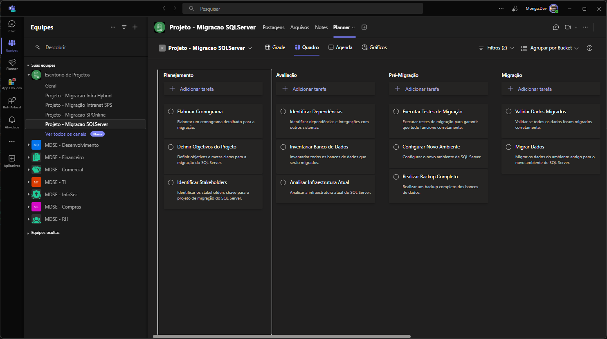

# Script PowerShell para Criar Plano e Canais no Microsoft Teams

## Descrição

Este script em PowerShell automatiza a criação de um plano no Microsoft Planner e dos canais associados em um time do Microsoft Teams, utilizando dados de um arquivo CSV. Esta automação inicial é parte de um projeto mais amplo para desenvolver um ciclo de vida completo de gerenciamento de projetos integrando Planner, SharePoint e Teams.

<br>

Meu objetivo final é estabelecer uma arquitetura lógica robusta para o gerenciamento de projetos para um clico de vida completa com os objetivos de criar um ambiente de gerenciamento de projetos no Microsoft 365 que ofereça os benefícios:

- **Consistência:** Garantir que todos os projetos sigam uma estrutura padrão, facilitando o gerenciamento e a colaboração, criando um fluxo automatizado que liga ao inicio do script e finaliza arquivando os recursos.
- **Agilidade:** Acelerar a criação de novos planos de projeto reutilizando templates existentes.
- **Organização:** Centralizar todos os templates em um repositorio, facilitando o acesso e a manutenção.

<br>

> **Nota:** Criei a arquitetura de provisionamento dos recurso me aprofundando mais do Backlog do Planner, desse modo o que funcionou com um melhor gerenciamento foi adotar templates de escopo de projetos em CSV, desse modo é possível criar um banco de templates para diferentes tipos de projetos, facilitando o provisionamento do planos, de forma rápida e padronizada.

<br>

# Índice

- [Modelos de Planos em CSV](#modelos-de-planos-em-csv)
    - [Formato do Arquivo CSV](#formato-do-arquivo-csv)
    - [Estrutura do Arquivo CSV](#estrutura-do-arquivo-csv)
- [Configuração do Aplicativo no Azure AD](#configuração-do-aplicativo-no-azure-ad)
    - [Passos para Criar um App Registration](#passos-para-criar-um-app-registration)
- [Usando Script](#usando-o-script)
    - [Parâmetros](#parâmetros)
        - [`-clientID`](#-clientid)
        - [`-tenantID`](#-tenantid)
        - [`-clientSecret`](#-clientsecret)
        - [`-GroupID`](#-groupid)
        - [`-PlanName`](#-planname)
        - [`-csvFilePath`](#-csvfilepath)
        - [`-teamsTabName`](#-teamstabname)
        - [`-channelDisplayName`](#-channeldisplayname)
        - [`-channelDescription`](#-channeldescription)


## Exemplo de Template: Projeto Migração SQL Server
`\data\Template_MigraSQL.csv`

|Task|Bucket|Details|
|---|---|---|
|Identificar Stakeholders|Planejamento|Identificar os stakeholders chave para o projeto de migração do SQL Server.|
|Elaborar Cronograma|Planejamento|Elaborar um cronograma detalhado para a migração.|
|Inventariar Banco de Dados|Avaliação|Inventariar todos os bancos de dados que serão migrados.|
|Identificar Dependências|Avaliação|Identificar dependências e integrações com outros sistemas.|
|Configurar Novo Ambiente|Pré-Migração|Configurar o novo ambiente de SQL Server.|
|Executar Testes de Migração|Pré-Migração|Executar testes de migração para garantir que tudo funcione corretamente.|
|Migrar Dados|Migração|Migrar os dados do ambiente antigo para o novo ambiente de SQL Server.|
|Validar Dados Migrados|Migração|Validar se todos os dados foram migrados corretamente.|
|Ajustar Configurações Pós-Migração|Pós-Migração|Ajustar configurações e otimizar o novo ambiente.|
|Realizar Testes de Desempenho|Pós-Migração|Realizar testes de desempenho no novo ambiente de SQL Server.|
|Obter Aprovação Final|Encerramento|Obter aprovação final dos stakeholders após a migração.|
|Documentar Lições Aprendidas|Encerramento|Documentar lições aprendidas e realizar um encerramento formal do projeto.|

## Imagem Exemplo




## Pré-requisitos

- PowerShell versão 5 ou superior

## Funcionalidades

- Cria um plano no Microsoft Planner
- Cria buckets no plano com base em dados de um arquivo CSV
- Cria tarefas nos buckets também baseadas no arquivo CSV
- Cria um canal no Microsoft Teams associado ao plano
- Adiciona uma tab do Planner ao canal do Teams

<br>


## Modelos de Planos em CSV

Para facilitar a criação e o gerenciamento de projetos no Microsoft Planner, ultilizo arquivos CSV padronizados. Abaixo estão as diretrizes para criar e usar esses arquivos:

### Formato do Arquivo CSV

- **Delimitador:** Utilize ponto e vírgula (`;`) como delimitador. Isso permite o uso de vírgulas (`,`) no campo de descrição da tarefa sem problemas.
- **Colunas Necessárias:** Certifique-se de que o arquivo CSV contenha as seguintes colunas:
    - **TaskName:** Nome da tarefa.
    - **BucketName:** Nome do bucket onde a tarefa será categorizada.
    - **Details:** Detalhes ou descrição da tarefa.

### Estrutura do Arquivo CSV

Seu arquivo CSV deve ter a seguinte estrutura:

```
TaskName;BucketName;Details 
Identificar Stakeholders;Planejamento;Identificar os stakeholders chave para o projeto de migração do SQL Server. 
Definir Objetivos do Projeto;Planejamento;Definir objetivos e metas claras para a migração do SQL Server. 
Elaborar Cronograma;Planejamento;Elaborar um cronograma detalhado para a migração. 
Analisar Infraestrutura Atual;Avaliação;Analisar a infraestrutura atual do SQL Server. 
Inventariar Banco de Dados;Avaliação;Inventariar todos os bancos de dados que serão migrados.
...
```

### Criação de um Banco de Templates

Recomendo a criação de um banco de templates próprios para diferentes tipos de projetos. Isso facilitará a padronização e agilidade na criação de novos planos de projeto. Conseguindo gerenciar um ciclo de vida completo de gerenciamento de projetos integrando Planner, SharePoint e Teams.

### Como Utilizar os Templates

1. **Crie seus Templates:** Crie templates de projetos em formato CSV seguindo a estrutura fornecida e salve-os na pasta [./templates](./templates).
2. **Padronize a Criação de Projetos:** Adotar internamente a prática de modelar o escopo de todos os projetos usando arquivos CSV com o formato padronizado.
3. **Edite os Templates:** Personalize os templates conforme necessário para cada projeto específico. Utilize um editor de planilhas (como Microsoft Excel ou Google Sheets) para facilitar a edição.
4. **Salve e Importe:** Certifique-se de salvar os arquivos CSV editados com ponto e vírgula (`;`) como delimitador. Use o script PowerShell fornecido para importar os arquivos CSV para o Microsoft Planner.

<br>

 >**NOTA:** Os templates de arquivos CSV prontos para uso estão disponíveis na pasta [./templates](./templates). Use esses templates como ponto de partida para criar e personalizar seus próprios modelos de projeto.

<br>

## Usando o Script

1. Clone este repositório em sua máquina local:
    ```bash
    #Clonar o repositorio
    git clone https://github.com/PoBruno/m365-project-lifecycle.git
    #Acessar a pasta Scripts
    cd m365-project-lifecycle/Scripts/
    ```

2. Configuração do Aplicativo no Azure AD:
    - Siga os passos acima para criar um App Registration, adicionar permissões do Microsoft Graph e gerar um Client Secret.

3. Abra o PowerShell (versão 7 ou superior).

4. Execute o script `Create-PlannerAndTeamsChannel.ps1` fornecendo os parâmetros necessários:

    ```powershell
    .\Create-PlannerAndTeamsChannel.ps1 `
        -clientID $clientID `
        -tenantID $tenantID `
        -clientSecret $clientSecret `
        -csvFilePath $csvFilePath `
        -PlanName $PlanName `
        -GroupID $groupID `
        [-teamsTabName $teamsTabName] `
        [-channelDisplayName $channelDisplayName] `
        [-channelDescription $channelDescription]
    ```
    Certifique-se de substituir os valores das variáveis pelos valores apropriados.

5. Verifique se todas as operações foram executadas com sucesso.

<br>


## Configuração do Aplicativo no Azure AD

Antes de executar o script, é necessário configurar um aplicativo no Azure AD para autenticar e autorizar as chamadas à API do Microsoft Graph.

### Passos para Criar um App Registration:

1. **Acessar o Portal do Azure:**
    
    - Acesse [https://portal.azure.com](https://portal.azure.com).
2. **Criar um novo App Registration:**
    
    - No portal do Azure, navegue até "Azure Active Directory" > "App registrations" > "New registration".
    - Forneça um nome para o aplicativo e escolha a opção de conta adequada.
3. **Configurar as Permissões de API (Microsoft Graph):**
    
    - Após criar o aplicativo, navegue até "API permissions".
    - Clique em "Add a permission" e selecione "Microsoft Graph".

4. **Adicionar Permissões (Scope) do Microsoft Graph:**
    
    - Para adicionar permissões do Microsoft Graph, clique em "Add a permission".
    - Selecione "Microsoft Graph" > "Application permissions".
    <br><br>
    - Application Permissions (Permissões de Aplicativo):

        - **Group.ReadWrite.All**: Permite que o aplicativo leia e escreva em todos os grupos.
        - **Group.Read.All**: Permite que o aplicativo leia todos os grupos.
        - **User.Read.All**: Permite que o aplicativo leia todos os usuários.
        - **Directory.ReadWrite.All**: Permite que o aplicativo leia e escreva em todos os dados do diretório.
        - **Tasks.ReadWrite**: Permite que o aplicativo leia e escreva tarefas no Planner.
        - **Channel.ReadWrite.All**: Permite que o aplicativo leia e escreva em todos os canais do Microsoft Teams.
    <br><br>
    
5. **Conceder Permissões:**
    
    - Após adicionar as permissões, você precisará concedê-las. Clique em "Grant admin consent for [tenant]" para garantir que as permissões sejam aplicadas ao locatário.
6. **Gerar Client Secret:**
    
    - Vá para "Certificates & secrets" no menu do aplicativo no portal do Azure.
    - Em "Client secrets", clique em "New client secret".
    - Forneça uma descrição e escolha a duração da expiração do segredo.
    - Copie o valor do segredo gerado. Este será usado como `$clientSecret` no script PowerShell.


## Parâmetros

### `-clientID`

- **Tipo:** String
- **Obrigatório:** Sim
- **Descrição:** ID do cliente usado para autenticação no Azure AD.

### ``-tenantID``

- **Tipo:** String
- **Obrigatório:** Sim
- **Descrição:** ID do locatário (tenant) usado para autenticação no Azure AD.

### ``-clientSecret``

- **Tipo:** String
- **Obrigatório:** Sim
- **Descrição:** Segredo do cliente usado para autenticação no Azure AD.

### ``-GroupID``

- **Tipo:** String
- **Obrigatório:** Sim
- **Descrição:** ID do grupo do Microsoft Teams onde o plano e os canais serão criados.

### ``-PlanName``

- **Tipo:** String
- **Obrigatório:** Sim
- **Descrição:** Nome do plano que será criado no Microsoft Planner.

### ``-csvFilePath``

- **Tipo:** String
- **Obrigatório:** Sim
- **Descrição:** Caminho do arquivo CSV contendo as tarefas e os buckets a serem importados. O CSV precisa conter o formato `TaskName;BucketName;Details`, hearder e delimitador ``;``.

### ``-teamsTabName``

- **Tipo:** String
- **Obrigatório:** Não (Padrão: "Planner")
- **Descrição:** Nome da aba do Teams onde o Planner será adicionado.

### ``-channelDisplayName``

- **Tipo:** String
- **Obrigatório:** Não (Padrão: Nome do plano)
- **Descrição:** Nome do canal a ser criado no Teams.

### ``-channelDescription``

- **Tipo:** String
- **Obrigatório:** Não (Padrão: "Canal para gerenciamento de tarefas do Planner - PlanName")
- **Descrição:** Descrição do canal a ser criado no Teams.

<br>

## Contribuições

Se você está interessado em contribuir para este projeto, estamos felizes em receber suas sugestões, correções de bugs e novas funcionalidades. Para começar, siga as orientações abaixo:

- Leia nosso [guia de contribuição](CONTRIBUTING.md) para entender como contribuir.
- **Abra uma issue** para discutir o que você gostaria de mudar antes de enviar um pull request.

## Autor

[Bruno Gomes](https://github.com/PoBruno)

## Licença

Este projeto está licenciado sob a [Licença MIT](./LICENSE.md).

## Agradecimentos

- [Planner](https://planner.uservoice.com/forums/330525-microsoft-planner-feedback-forum)
- [Teams](https://microsoftteams.uservoice.com/forums/555103-public?category_id=210045)
- [Microsoft Graph](https://docs.microsoft.com/pt-br/graph/overview)
- [Azure AD](https://docs.microsoft.com/pt-br/azure/active-directory/)
- [PowerShell](https://docs.microsoft.com/pt-br/powershell/scripting/overview?view=powershell-7.1)
- [Microsoft Graph API](https://developer.microsoft.com/pt-br/graph)

